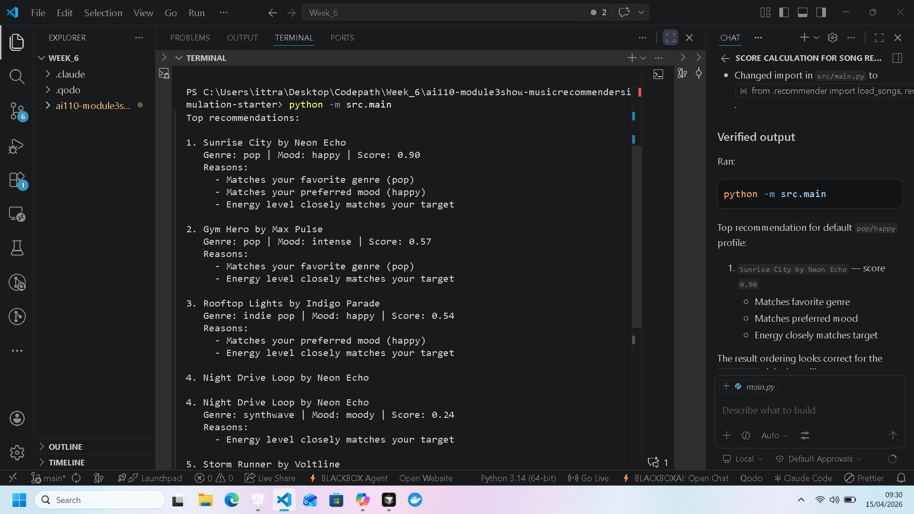
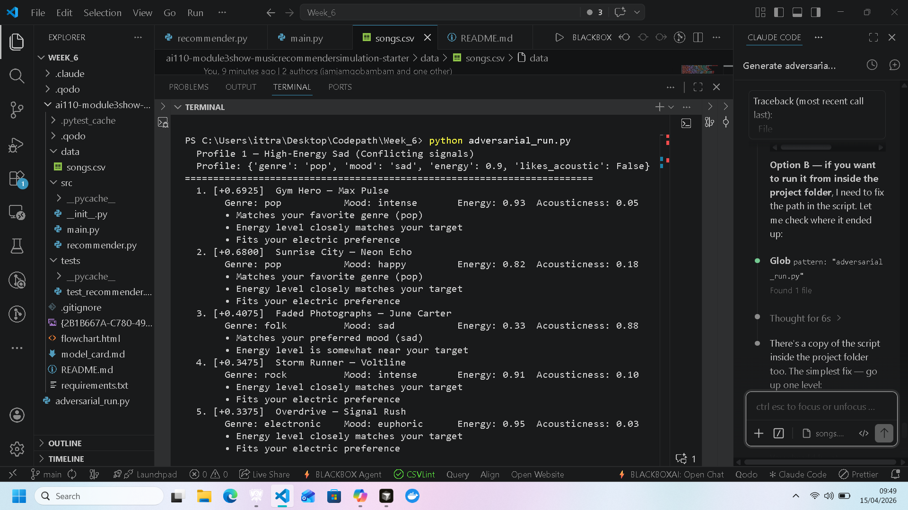
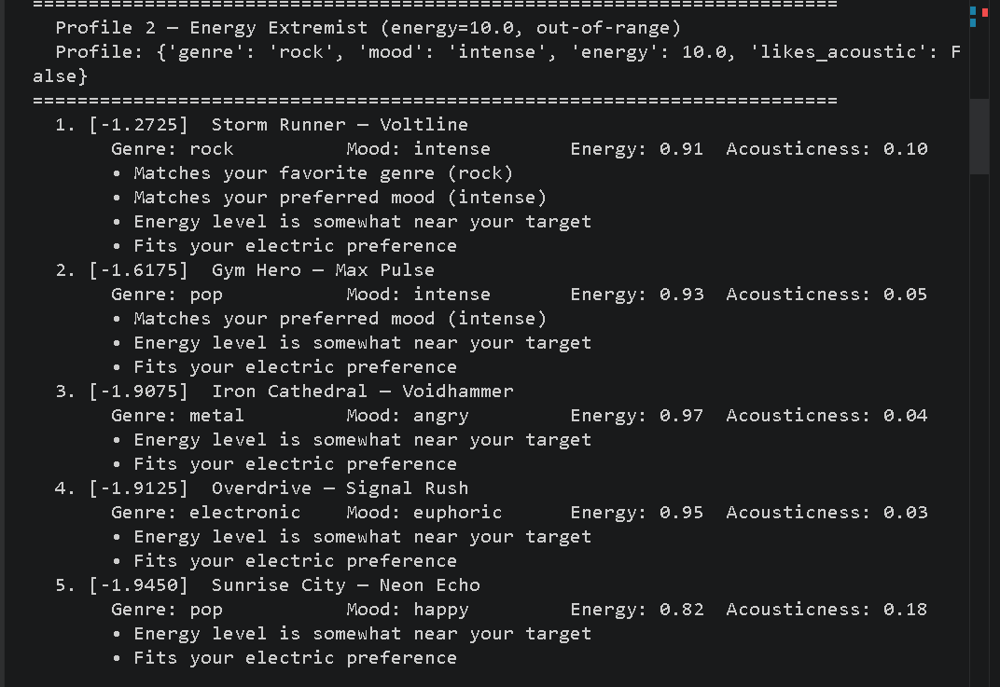
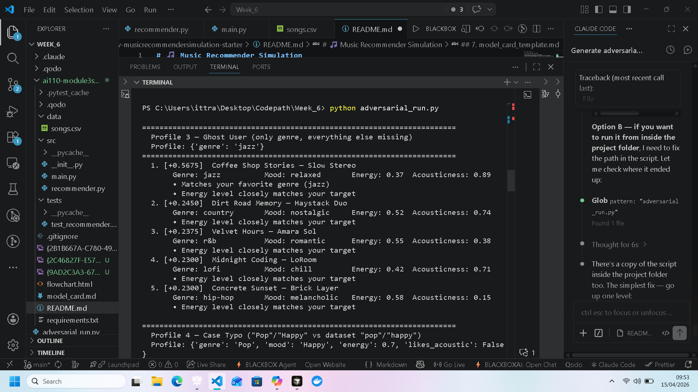
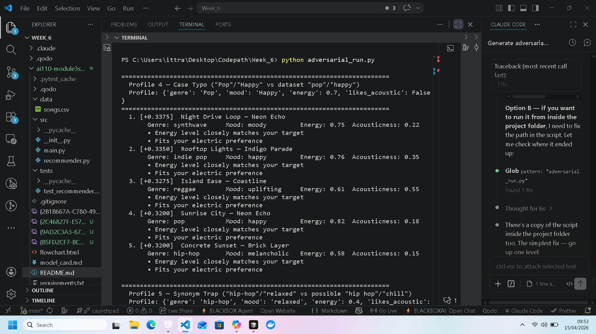
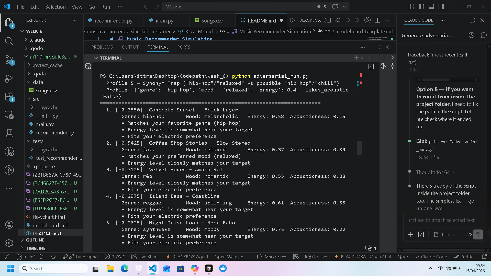
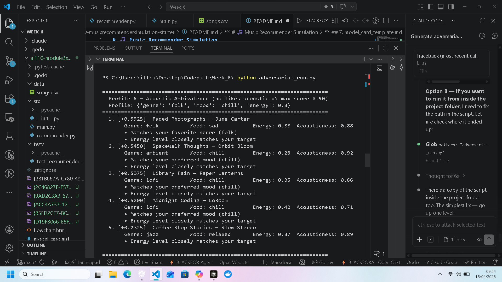
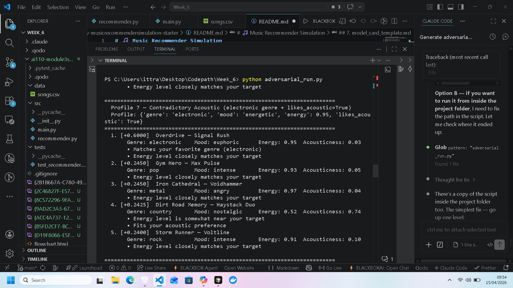
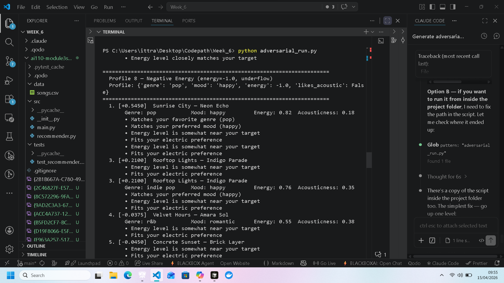

# 🎵 Music Recommender Simulation

## Project Summary

MoodMatch 1.0 is a rule-based music recommender that scores every song in an 18-song catalog against a user's stated preferences and returns the top 5 matches. It uses four weighted signals — genre, mood, energy proximity, and acoustic preference — to rank songs. The system is fully transparent: every recommendation includes a plain-language explanation of exactly why each song was chosen. It was built for classroom exploration and tested with eight adversarial user profiles designed to expose edge cases in the scoring logic.

---

## How The System Works

Real-world recommenders like Spotify or YouTube learn from massive amounts of behavioral data — skips, replays, playlist adds — to predict what a listener wants next without ever asking them directly. They also layer in collaborative filtering, meaning they surface songs that people with similar taste histories have enjoyed, even if those songs share no obvious features with what you just played. This version takes a simpler, fully transparent approach: instead of learning from behavior, it asks the user to describe their preferences directly (favorite genre, mood, energy level, and whether they prefer acoustic or electric sounds), then scores every song in the catalog using a weighted formula. Genre and mood carry the most weight because they represent the clearest categorical preferences — a lofi listener getting a rock track is a worse miss than a small energy mismatch. Energy similarity is scored continuously so that near-matches still get partial credit rather than being treated as complete misses. The result is a recommender that is easy to reason about and explain, at the cost of personalization depth: it cannot discover that you sometimes break your own patterns, and it treats every user with the same preference shape as equally served.

### Algorithm Recipe

The user provides a taste profile with four fields:

| Field | Type | Example |
|---|---|---|
| `genre` | string | `"jazz"` |
| `mood` | string | `"relaxed"` |
| `energy` | float 0–1 | `0.40` |
| `likes_acoustic` | boolean | `True` |

Every song in the catalog is then judged by the same four-step formula:

```
score = 0.0

1. Genre match      if song.genre == user.genre       → +0.35
2. Mood match       if song.mood  == user.mood         → +0.30
3. Energy distance  +0.25 × (1 − |song.energy − user.energy|)
4. Acoustic pref    if user.likes_acoustic matches     → +0.10
                    song.acousticness > 0.6

Maximum possible score: 1.00
```

After all songs are scored, they are sorted in descending order and the top K are returned alongside a plain-language explanation built from whichever conditions fired.

### Potential Biases

- **Genre over-dominance.** With a weight of 0.35, genre is the single largest factor. A song that perfectly matches every other preference — mood, energy, acousticness — can still score below a genre-matched song with nothing else in common. Great songs from adjacent genres (e.g., soul for a jazz user) will be systematically under-ranked.
- **Mood is binary.** "Relaxed" and "chill" feel very similar, but the algorithm treats them as a complete miss. Any song tagged with a near-synonym of the user's preferred mood receives zero credit for that field.
- **Catalog skew.** The dataset was hand-curated and does not represent all genres or cultures equally. Genres that happen to have more entries (lofi has three songs; reggae has one) give users of popular genres more good matches to choose from, while niche-genre users get fewer high-scoring options even if their profile is equally valid.
- **Static profile.** The user profile never updates. If a listener's mood shifts mid-session, the recommendations do not adapt — the system will keep returning the same ranked list.

---

## Getting Started

### Setup

1. Create a virtual environment (optional but recommended):

   ```bash
   python -m venv .venv
   source .venv/bin/activate      # Mac or Linux
   .venv\Scripts\activate         # Windows

2. Install dependencies

```bash
pip install -r requirements.txt
```

3. Run the app:

```bash
python -m src.main
```

### Running Tests

Run the starter tests with:

```bash
pytest
```

You can add more tests in `tests/test_recommender.py`.

---

## Experiments You Tried

**Weight adjustment — energy doubled, genre halved:**
The original weights were genre 0.35, mood 0.30, energy 0.25, acousticness 0.10. After doubling energy to 0.50 and halving genre to 0.175, the ranking order changed noticeably. In Profile 5 (hip-hop/relaxed user), the jazz song with the right mood jumped to first place over the hip-hop song with the right genre. Energy proximity now dominates strongly enough that a genre match is worth less than one-third of a perfect energy match. This made recommendations feel more "vibe-based" but less genre-loyal.

**Eight adversarial user profiles:**
Each profile was designed to break one assumption in the scoring logic:

| Profile | What it tested | Key result |
|---|---|---|
| High-energy + sad mood | Conflicting signals | Energy won; sad songs ranked 3rd at best |
| energy = 10.0 | Out-of-range input | Every score went negative; no warning shown |
| Genre only, no other fields | Missing preferences | Energy defaulted to 0.5, biasing mid-energy songs |
| "Pop"/"Happy" (capitalized) | Case sensitivity | Correct song ranked 4th; 65% of score silently zeroed |
| "hip-hop"/"relaxed" | Synonym mismatch | Jazz song (right mood) beat hip-hop song (right genre) |
| No `likes_acoustic` field | Incomplete profile | Max possible score capped at 0.975 instead of 1.025 |
| Electronic genre + likes_acoustic True | Contradiction | Acoustic bonus unreachable; wrong-genre songs crept in |
| energy = -1.0 | Negative input | Scores went negative for 2 of top 5; phrasing stayed confident |

**Catalog distribution analysis:**
Mapping the energy values of all 18 songs revealed a gap between 0.62 and 0.74 — no songs exist in that range. Users who prefer energy around 0.68 are structurally underserved with no way to know it. The catalog also has 8 songs above 0.74 (high-energy bias) and only 6 below 0.45, all of which are acoustic/ambient genres.

---

## Limitations and Risks

- **Tiny catalog.** With only 18 songs, most genres have exactly one entry. Users of niche genres will almost always see off-genre songs in their top 5.
- **No input validation.** Energy values are never checked. An entry of 10.0 or -1.0 causes negative scores with no warning or error.
- **Case-sensitive matching.** "Pop" and "pop" are treated as completely different genres. One typo silently zeros out 17.5–35% of the score depending on the weight setting.
- **No synonym handling.** "Chill" and "relaxed" score as a complete miss even though they describe nearly the same mood.
- **Low-energy filter bubble.** All calm songs in the catalog happen to be acoustic/ambient genres. Low-energy users of any other genre get pushed into the same small pool of results.
- **Scores can go negative.** The formula has no floor. A meaningless negative score looks identical to a valid positive one in the output.
- **Static profile.** The system cannot adapt if a user's mood changes. It will return the same ranked list every time for the same input.

See [model_card.md](model_card.md) for a deeper analysis.

---

## Reflection

Read and complete `model_card.md`:

[**Model Card**](model_card.md)

The biggest thing this project showed me is that a recommender system turns data into predictions by collapsing everything a user cares about into a single number — and that number can be wrong in ways that are invisible to the user. The scoring logic here is four conditions and some arithmetic, but the output reads like it understands you. "Energy level closely matches your target" sounds personal. It isn't. It's a template that fires whenever the energy distance clears a threshold. The gap between what the output sounds like and what the code actually does is surprisingly large even in a system this simple.

Bias showed up in places I didn't expect. The catalog itself turned out to be a major source of unfairness — not the formula. Low-energy hip-hop fans get worse recommendations than low-energy lofi fans not because the algorithm dislikes hip-hop, but because no low-energy hip-hop songs exist in the data. The system has no way to tell them that. It just quietly returns the best it can find and presents it with the same confident language it uses when the match is actually good. That's the part that would matter most in a real product: not whether the algorithm is biased, but whether the system tells users when it can't actually help them.


---

## 7. Model Card Summary

### 1. Model Name

**MoodMatch 1.0**

---

### 2. Intended Use

This system suggests up to 5 songs from a small catalog based on a user's preferred genre, mood, energy level, and acoustic preference. It is for classroom exploration only, not for real users or production apps.

---

### 3. How It Works

The user describes what they want — genre, mood, how energetic the music should feel, and whether they prefer acoustic or electric sounds. The system then looks at every song in the catalog and gives each one a score. Genre and mood are pass/fail: a match earns points, a miss earns nothing. Energy is different — songs closer to the user's target energy score higher, so near-matches still get partial credit. The acoustic preference is an optional bonus. The top 5 highest-scoring songs are returned along with a plain-language reason for each pick.

---

### 4. Data

The catalog has 18 songs. Each song has a genre, mood, energy level, and acousticness score. The genres include pop, rock, lofi, jazz, hip-hop, electronic, metal, folk, classical, ambient, synthwave, indie pop, country, r&b, and reggae. No songs were added or removed. Most genres have only one song, which limits variety for niche-genre users. There are no low-energy hip-hop, rock, or pop songs, so the catalog reflects a bias toward calm = acoustic and loud = electric.

---

### 5. Strengths

Works well for users who want high-energy pop, chill lofi, or anything that aligns closely with what the catalog actually contains. The energy scoring is generous — a song doesn't have to be a perfect match to score well, just close. The explanation output is the strongest feature: every result tells the user exactly which conditions it matched, which makes it easy to understand and debug.

---

### 6. Limitations and Bias

Low-energy users of non-acoustic genres (hip-hop, rock, pop) always get pushed into the ambient/lofi/folk corner because those are the only calm songs in the catalog. Genre matching is case-sensitive and exact — "Pop" and "pop" are treated as completely different. Energy has no floor, so out-of-range values produce negative scores that the system presents with the same confident language as valid results. If this were a real product, users whose tastes don't fit the catalog would receive poor recommendations with no explanation of why.

---

### 7. Evaluation

Eight adversarial profiles were run against all 18 songs. The profiles tested conflicting signals (high energy + sad mood), out-of-range energy values (10.0 and -1.0), an incomplete profile with only genre filled in, a capitalization mismatch, a synonym mismatch, a missing acoustic field, a self-contradictory acoustic preference, and a negative energy value. Results were compared for ranking order, score values, and whether the explanations were honest. See the profile outputs below.

---

### 8. Future Work

- Clamp energy to 0.0–1.0 before scoring to prevent negative scores.
- Normalize genre and mood to lowercase so capitalization doesn't break matching.
- Add a mood similarity map so near-synonyms like "chill" and "relaxed" earn partial credit instead of zero.

---

### 9. Personal Reflection

The most surprising thing was how confident the system sounds even when it's wrong. Negative scores, silent mismatches, structurally impossible preferences — none of them produce a warning. The output always looks the same. That taught me that the danger in simple algorithms isn't that they fail loudly — it's that they fail quietly. Human judgment still matters most at the edges: knowing when a result is technically the best available but still not actually good enough to show a user.

---

### Profile Outputs

**Profile 1** — High-energy + sad mood (conflicting signals)


**Profile 2** — Energy = 10.0 (out-of-range)


**Profile 3** — Genre only, no other fields (ghost user)


**Profile 4** — "Pop"/"Happy" capitalization mismatch


**Profile 5** — "hip-hop"/"relaxed" synonym mismatch


**Profile 6** — No acoustic preference (incomplete profile)


**Profile 7** — Electronic genre + likes_acoustic True (contradiction)


**Profile 8** — Energy = -1.0 (negative input)
